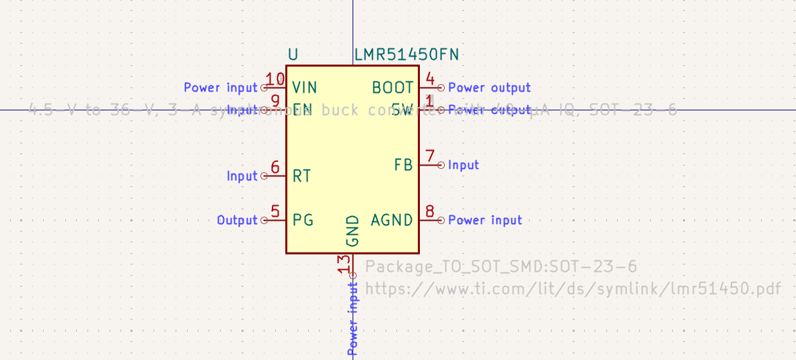
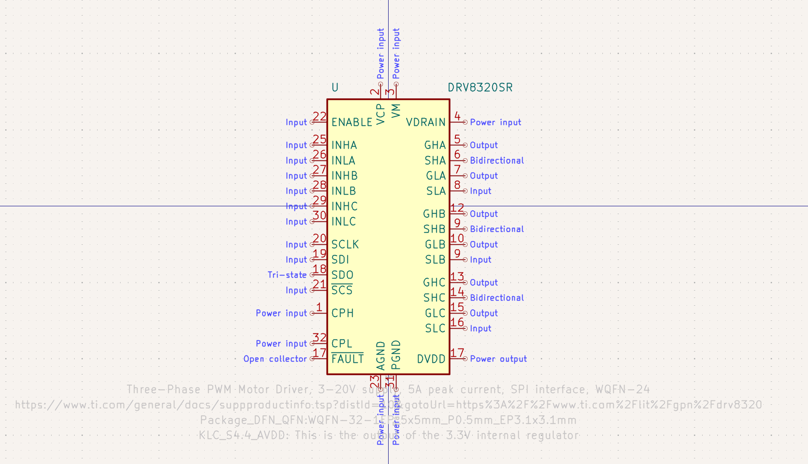
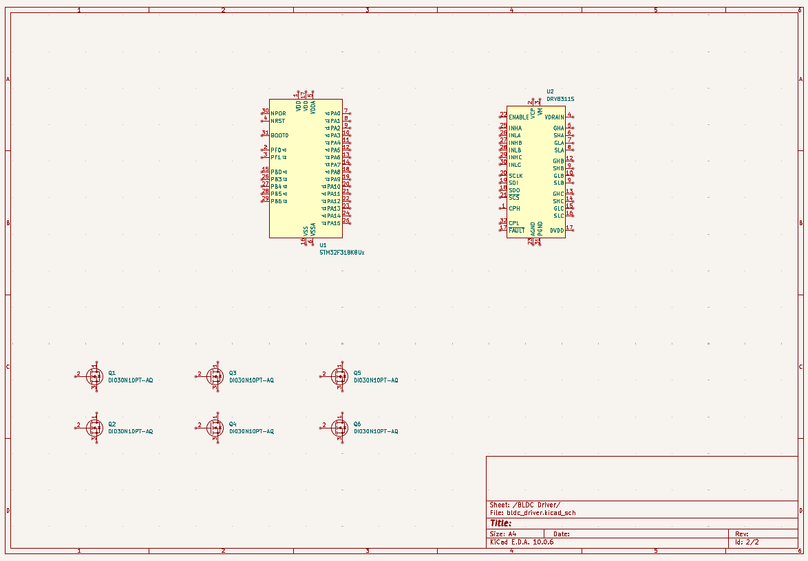

# October 10: Selected initial parts

I started by selecting the parts. Since there will be four identical motor driver circuits I will be trying kicad's sheets feature to make one driver circuit and copy it four times. I want this circuit to do two functions: to drive four brushless motors and to provide a stable 3.3v to the rest of the drone. Because this is the board connected to the battery it makes sense to also put the primary regulator on it too. For this I chose the LMR51450FN as has the specs I need with 5 amps out and is pretty cheap. I had to make a custom symbol for this because kicad didn't have one.

For the mcu for each driver I chose the STM32F318K8U6 as it was one of the cheapest ones I could find from ST's F3 or G4 lines which are made for signal processing. Even still each mcu is $5 and if I find a cheaper one that will do the job I'll use that instead. For the gate driver I chose the DRV8320S as I've worked with TI gate drivers before and this one was also fairly cheap. Kicad didn't have a footprint for it so I modified the foot print for the DRV8311S. 

I then chose a mosfet for the actual gates. I found the DI030N10PT-AQ on digikey which was surprisingly cheap and was rated for 30A and 100V which is plenty. 

**Total time spent: 3 hours**
